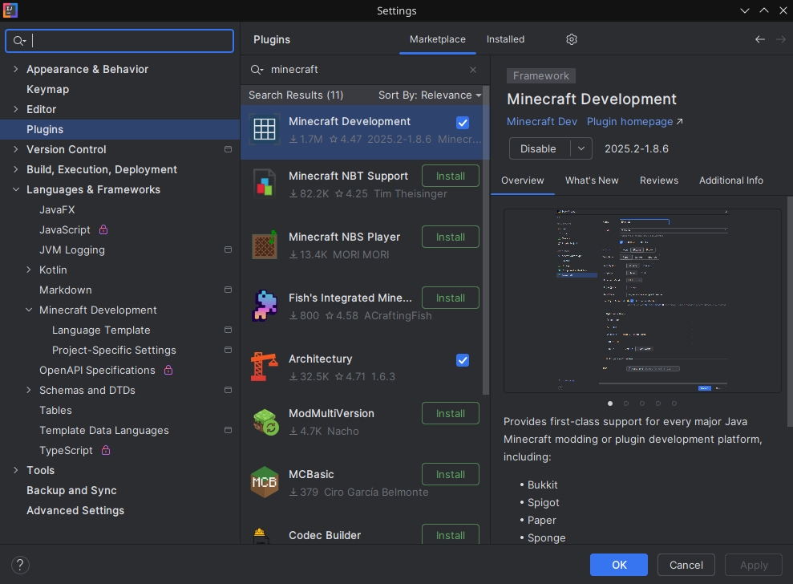
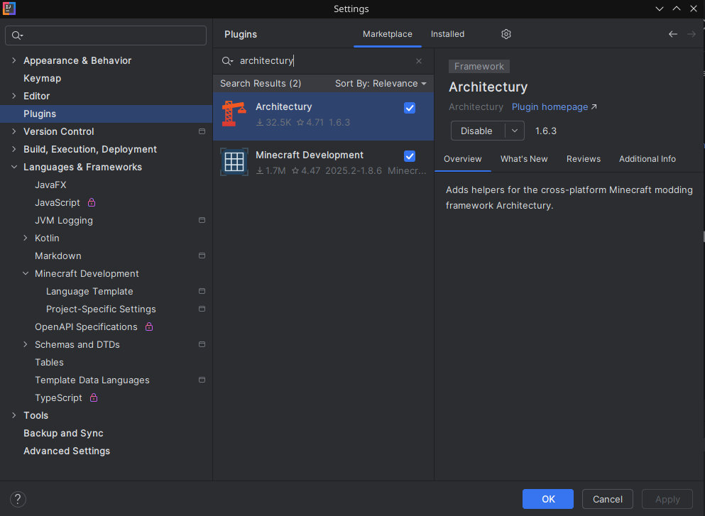
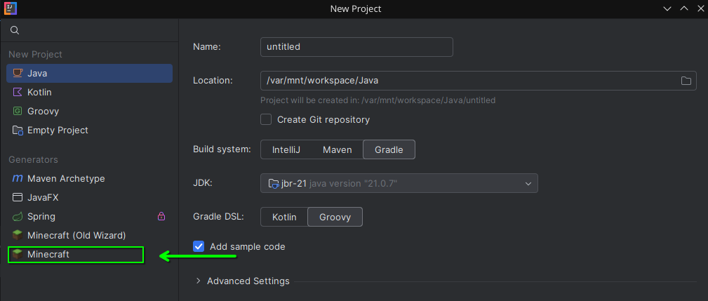
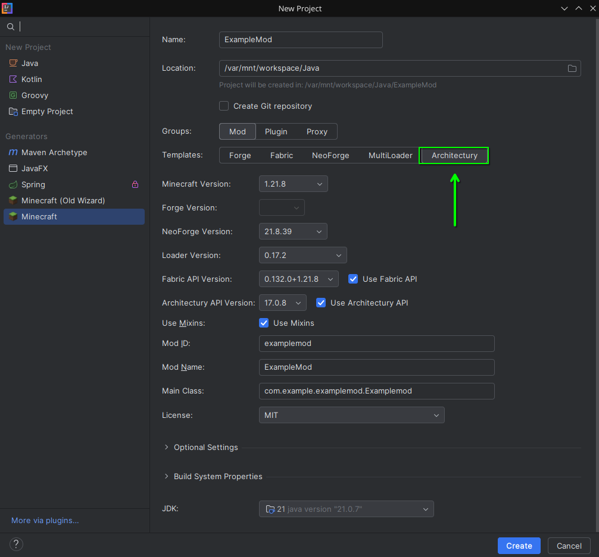

[](../architectury/getting_started.md) [](../fabric/getting_started.md) [](../neoforge/getting_started.md)

# Getting Started(Architectury)
**This tutorial assumes you are using Intellij(Highly Recommended)!**

## Setup:
### 1. Download & install [Intellij Community Edition](https://www.jetbrains.com/idea/download):


### 2. Install Minecraft & Architectury plugins:
#### Tip: `Ctrl` + `Alt` + `s` to open settings.




## 3. Create your mod project:
### Select the "Minecraft" wizard

### Select Architectury as the Template


### Fill in your information:
- Name(ex. ExampleMod)
- Group ID Build System Properties -> Group ID(ex. `com.example` OR `com.github.yourusername`)
- Version Build System Properties -> Version(ex. `1.0.0` OR `1.0.0-alpha`)

### Hit `Create`:


## Importing ShieldLib:

### 1. Version
#### Add `shieldlib_version` to your `gradle.properties`. Find [Latest full release](https://github.com/StellarWind22/Shield-Lib/releases/latest)
```properties
shieldlib_version=[VERSION] (ex. 2.0.0-1.21.8)
```

### 2. Add to subprojects
#### Add modrinth maven repository in common, fabric, & neoforge `build.gradle`
```gradle
repositories {
    //other stuff here
    maven {url = "https://api.modrinth.com/maven"}
}
```

#### Add to dependencies using `modImplementation`

common & fabric:
```gradle
dependencies {
    //other stuff here
    modImplementation "maven.modrinth:shieldlib:${project.shieldlib_version}-fabric"
}
```

neoforge:
```gradle
dependencies {
    //other stuff here
    modImplementation "maven.modrinth:shieldlib:${project.shieldlib_version}-neoforge"
}
```

---

### Creating your first shield:
- [Vanilla Style](tower_shield.md)
- [Bring Your Own Model](component_shield.md)
- [New shield shape](new_shape_shield.md)

---
[](../architectury/getting_started.md) [](../fabric/getting_started.md) [](../neoforge/getting_started.md)