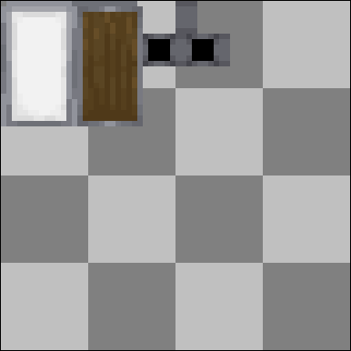
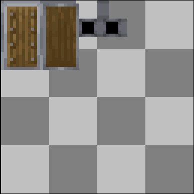
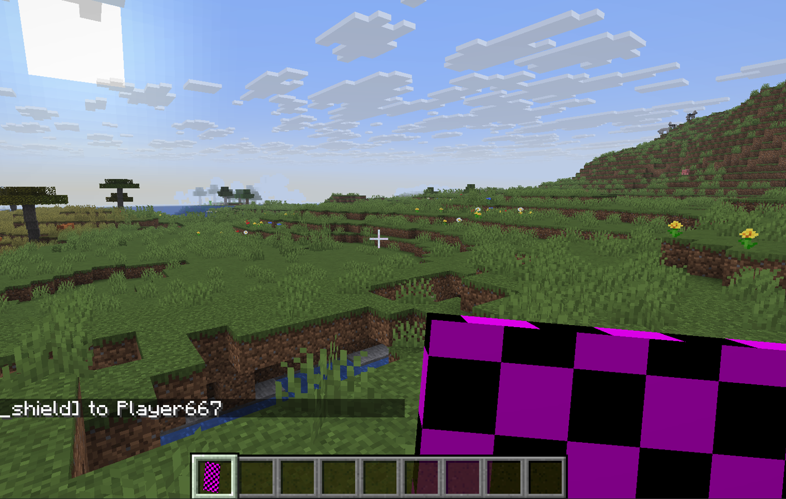
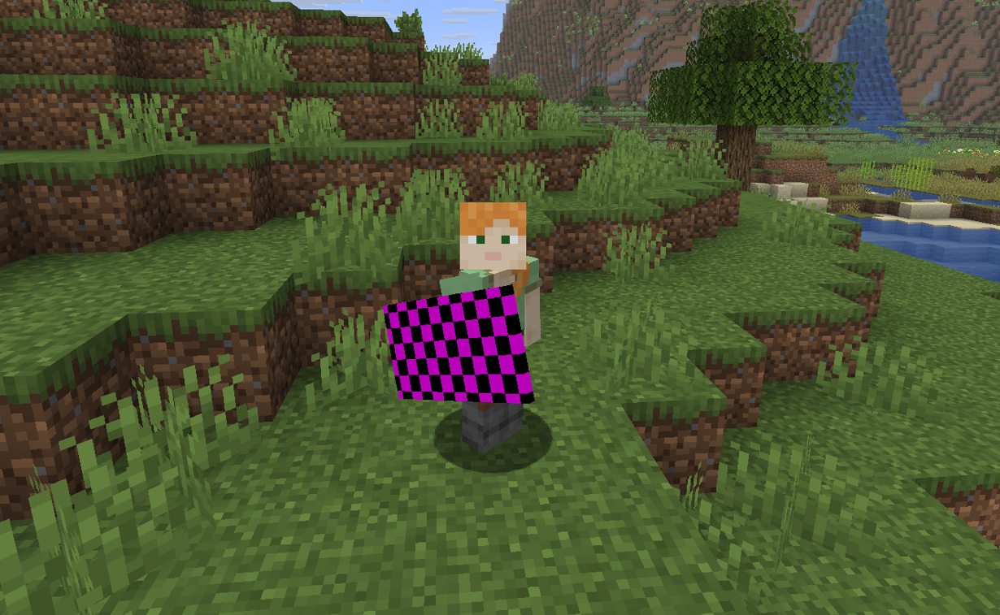

[](../architectury/tower_shield.md)
[](../fabric/tower_shield.md)
[](../neoforge/tower_shield.md)


## Step 1.
Register a shield. click [here](https://docs.fabricmc.net/develop/items/first-item) for a fabric item tutorial.

```java
public final class ExampleItems {
    
    public static final Item example_SHIELD = register("example_shield", 
            (props) -> new ShieldLibItem(
                    ShieldLibUtils.towerShieldProperties(props).durability(336),
                    Items.OAK_PLANKS
            ),
    new Item.Properties());
}

public static Item register(String name, Function<Item.Properties, Item> itemFactory, Item.Properties settings) {
    //Create key
    ResourceKey<Item> key = ResourceKey.create(Registries.ITEM, ResourceLocation.fromNamespaceAndPath(ExampleMod.MOD_ID, name));
    
    //Create item instance
    Item item = itemFactory.apply(settings.setId(key));
    
    //Register
    Registry.register(BuiltInRegistries.ITEM, key, item);
}
```

## Step 2.
Create asset files.

**IMPORTANT: Tell minecraft to include your shield textures in the shield texture atlas!**

This lets minecraft know where the textures are & allows ShieldLib to render them correctly!

You must add these two texture entries for every shield you add that supports banners.
- `src/main/resources/assets/minecraft/atlases/shield_patterns.json`:
```json
{
  "sources": [
    {
      "type": "single",
      "resource": "examplemod:entity/example_shield_base"
    },
    {
      "type": "single",
      "resource": "examplemod:entity/example_shield_base_nopattern"
    }
  ]
}
```

The item model for a tower(Vanilla Style) shield should look like this.
- `src/main/resources/assets/examplemod/models/item/example_shield.json`:
```json
{
	"gui_light": "front",
	"textures": {
		"particle": "examplemod:entity/example_shield_base_nopattern"
	},
	"display": {
		"thirdperson_righthand": {
			"rotation": [ 0, 90, 0 ],
			"translation": [ 10, 6, -4 ],
			"scale": [ 1, 1, 1 ]
		},
		"thirdperson_lefthand": {
			"rotation": [ 0, 90, 0 ],
			"translation": [ 10, 6, 12 ],
			"scale": [ 1, 1, 1 ]
		},
		"firstperson_righthand": {
			"rotation": [ 0, 180, 5 ],
			"translation": [ -10, 2, -10 ],
			"scale": [ 1.25, 1.25, 1.25 ]
		},
		"firstperson_lefthand": {
			"rotation": [ 0, 180, 5 ],
			"translation": [ 10, 0, -10 ],
			"scale": [ 1.25, 1.25, 1.25 ]
		},
		"gui": {
			"rotation": [ 15, -25, -5 ],
			"translation": [ 2, 3, 0 ],
			"scale": [ 0.65, 0.65, 0.65 ]
		},
		"fixed": {
			"rotation": [ 0, 180, 0 ],
			"translation": [ -4.5, 4.5, -5],
			"scale":[ 0.55, 0.55, 0.55]
		},
		"ground": {
			"rotation": [ 0, 0, 0 ],
			"translation": [ 2, 4, 2],
			"scale":[ 0.25, 0.25, 0.25]
		}
	}
}
```

The `blocking` variant of the model should look like this for a tower shield.

- `src/main/resources/assets/examplemod/models/item/example_shield_blocking.json`:
```json
{
	"gui_light": "front",
	"textures": {
		"particle": "examplemod:entity/example_shield_base_nopattern"
	},
	"display": {
		"thirdperson_righthand": {
			"rotation": [ 45, 155, 0 ],
			"translation": [ -3.49, 11, -2 ],
			"scale": [ 1, 1, 1 ]
		},
		"thirdperson_lefthand": {
			"rotation": [ 45, 155, 0 ],
			"translation": [ 11.51, 7, 2.5 ],
			"scale": [ 1, 1, 1 ]
		},
		"firstperson_righthand": {
			"rotation": [ 0, 180, -5 ],
			"translation": [ -15, 5, -11 ],
			"scale": [ 1.25, 1.25, 1.25 ]
		},
		"firstperson_lefthand": {
			"rotation": [ 0, 180, -5 ],
			"translation": [ 5, 5, -11 ],
			"scale": [ 1.25, 1.25, 1.25 ]
		},
		"gui": {
			"rotation": [ 15, -25, -5 ],
			"translation": [ 2, 3, 0 ],
			"scale": [ 0.65, 0.65, 0.65 ]
		}
	}
}
```

## Step 3.
Add your texture files in the appropriate folders for your mod

It should look something like:
- `src/main/resources/assets/examplemod/textures/entity/example_shield_base.png`
- `src/main/resources/assets/examplemod/textures/entity/example_shield_base_nopattern.png`

### The layout of a tower shield's textures looks like this:



### Here are some correctly sized template files:
- [`tower_shield_base.png`](../../image/tower_shield_base.png)
- [`tower_shield_base_nopattern.png`](../../image/tower_shield_base_nopattern.png)

Assuming all the files are in the correct places it should work and display correctly in game(like this):



**IMPORTANT: It will be solid black/purple instead of small checkers or invisible if the file failed to load/wasn't found!**

---
[](../architectury/tower_shield.md)
[](../fabric/tower_shield.md)
[](../neoforge/tower_shield.md)